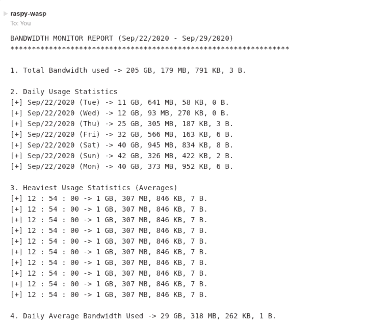

# Bandwidth Monitor

## Description
A packet sniffer that runs as a background process to monitor the network throughput and email the system administrator the statistics on a weekly basis. 

## Setup
The program requires pcap.h which can be downloaded on Ubuntu using the following command.
```
sudo apt-get install libpcap-dev
```

## Execution 
The program can be compiled and executed from the terminal using the commands.
```
g++ monitor.cpp -lpcap -pthread -o monitor
sudo ./monitor
```
## Sample Output
